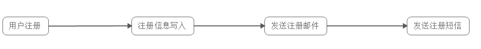
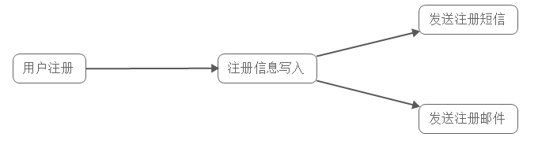
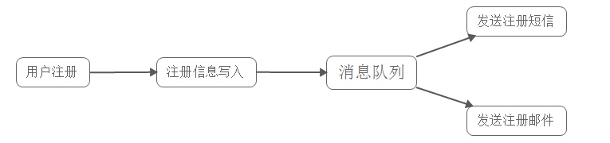
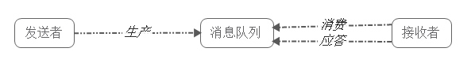
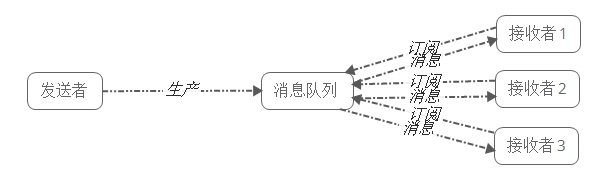
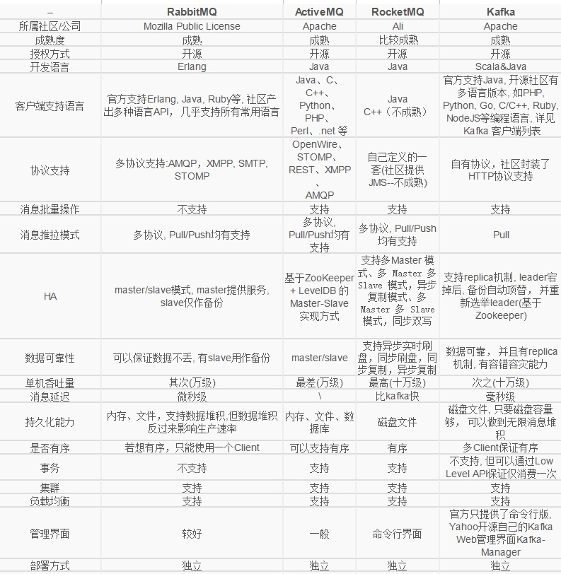

# 消息队列

消息队列是分布式系统中重要的组件，在很多生产环境如商品抢购等需要控制并发量的场景下都需要用到。最近组内需要做流水server的选型升级，这里对消息队列及常见的消息队列进行了一次调研，整理了相关资料，分享给大家。

## 一、消息队列(MQ)概述
消息队列（Message Queue），是分布式系统中重要的组件，其通用的使用场景可以简单地描述为：
当不需要立即获得结果，但是并发量又需要进行控制的时候，差不多就是需要使用消息队列的时候。
消息队列主要解决了应用耦合、异步处理、流量削锋等问题。
当前使用较多的消息队列有RabbitMQ、RocketMQ、ActiveMQ、Kafka、ZeroMQ、MetaMq等，而部分数据库如Redis、Mysql以及phxsql也可实现消息队列的功能。

## 二、消息队列使用场景
消息队列在实际应用中包括如下四个场景：

- 应用耦合：多应用间通过消息队列对同一消息进行处理，避免调用接口失败导致整个过程失败；
- 异步处理：多应用对消息队列中同一消息进行处理，应用间并发处理消息，相比串行处理，减少处理时间；
- 限流削峰：广泛应用于秒杀或抢购活动中，避免流量过大导致应用系统挂掉的情况；
- 消息驱动的系统：系统分为消息队列、消息生产者、消息消费者，生产者负责产生消息，消费者(可能有多个)负责对消息进行处理；

下面详细介绍上述四个场景以及消息队列如何在上述四个场景中使用：

### 2.1 异步处理

具体场景：用户为了使用某个应用，进行注册，系统需要发送注册邮件并验证短信。对这两个操作的处理方式有两种：串行及并行。

- 串行方式：新注册信息生成后，先发送注册邮件，再发送验证短信；

在这种方式下，需要最终发送验证短信后再返回给客户端。
    
- 并行处理：新注册信息写入后，由发短信和发邮件并行处理；

在这种方式下，发短信和发邮件需处理完成后再返回给客户端。

假设以上三个子系统处理的时间均为50ms，且不考虑网络延迟，则总的处理时间：

串行：50+50+50=150ms 并行：50+50 = 100ms

若使用消息队列：
        
并在写入消息队列后立即返回成功给客户端，则总的响应时间依赖于写入消息队列的时间，而写入消息队列的时间本身是可以很快的，基本可以忽略不计，因此总的处理时间相比串行提高了2倍，相比并行提高了一倍；

### 2.2 应用耦合

具体场景：用户使用QQ相册上传一张图片，人脸识别系统会对该图片进行人脸识别，一般的做法是，服务器接收到图片后，图片上传系统立即调用人脸识别系统，调用完成后再返回成功，如下图所示：

该方法有如下缺点：

- 人脸识别系统被调失败，导致图片上传失败；
- 延迟高，需要人脸识别系统处理完成后，再返回给客户端，即使用户并不需要立即知道结果；
- 图片上传系统与人脸识别系统之间互相调用，需要做耦合；

若使用消息队列：

客户端上传图片后，图片上传系统将图片信息如uin、批次写入消息队列，直接返回成功；而人脸识别系统则定时从消息队列中取数据，完成对新增图片的识别。

此时图片上传系统并不需要关心人脸识别系统是否对这些图片信息的处理、以及何时对这些图片信息进行处理。事实上，由于用户并不需要立即知道人脸识别结果，人脸识别系统可以选择不同的调度策略，按照闲时、忙时、正常时间，对队列中的图片信息进行处理。

### 2.3 限流削峰

具体场景：购物网站开展秒杀活动，一般由于瞬时访问量过大，服务器接收过大，会导致流量暴增，相关系统无法处理请求甚至崩溃。而加入消息队列后，系统可以从消息队列中取数据，相当于消息队列做了一次缓冲。

该方法有如下优点：

请求先入消息队列，而不是由业务处理系统直接处理，做了一次缓冲,极大地减少了业务处理系统的压力；

队列长度可以做限制，事实上，秒杀时，后入队列的用户无法秒杀到商品，这些请求可以直接被抛弃，返回活动已结束或商品已售完信息；

### 2.4 消息驱动的系统
具体场景：用户新上传了一批照片， 人脸识别系统需要对这个用户的所有照片进行聚类，聚类完成后由对账系统重新生成用户的人脸索引(加快查询)。这三个子系统间由消息队列连接起来，前一个阶段的处理结果放入队列中，后一个阶段从队列中获取消息继续处理。

该方法有如下优点：

避免了直接调用下一个系统导致当前系统失败；

每个子系统对于消息的处理方式可以更为灵活，可以选择收到消息时就处理，可以选择定时处理，也可以划分时间段按不同处理速度处理；

## 三、消息队列的两种模式

消息队列包括两种模式，点对点模式（point to point， queue）和发布/订阅模式（publish/subscribe，topic）。

### 3.1 点对点模式
点对点模式下包括三个角色：

- 消息队列

- 发送者 (生产者)

- 接收者（消费者）

消息发送者生产消息发送到queue中，然后消息接收者从queue中取出并且消费消息。消息被消费以后，queue中不再有存储，所以消息接收者不可能消费到已经被消费的消息。

点对点模式特点：

每个消息只有一个接收者（Consumer）(即一旦被消费，消息就不再在消息队列中)；

发送者和接收者间没有依赖性，发送者发送消息之后，不管有没有接收者在运行，都不会影响到发送者下次发送消息；

接收者在成功接收消息之后需向队列应答成功，以便消息队列删除当前接收的消息；

3.2 发布/订阅模式
发布/订阅模式下包括三个角色：

角色主题（Topic）

发布者(Publisher)

订阅者(Subscriber)

发布者将消息发送到Topic,系统将这些消息传递给多个订阅者。

发布/订阅模式特点：

每个消息可以有多个订阅者；

发布者和订阅者之间有时间上的依赖性。针对某个主题（Topic）的订阅者，它必须创建一个订阅者之后，才能消费发布者的消息。

为了消费消息，订阅者需要提前订阅该角色主题，并保持在线运行；

## 四、常用消息队列介绍

本部分主要介绍四种常用的消息队列（RabbitMQ/ActiveMQ/RocketMQ/Kafka）的主要特性、优点、缺点。

### 4.1 RabbitMQ

RabbitMQ 2007年发布，是一个在AMQP(高级消息队列协议)基础上完成的，可复用的企业消息系统，是当前最主流的消息中间件之一。

主要特性：

可靠性: 提供了多种技术可以让你在性能和可靠性之间进行权衡。这些技术包括持久性机制、投递确认、发布者证实和高可用性机制；

灵活的路由： 消息在到达队列前是通过交换机进行路由的。RabbitMQ为典型的路由逻辑提供了多种内置交换机类型。如果你有更复杂的路由需求，可以将这些交换机组合起来使用，你甚至可以实现自己的交换机类型，并且当做RabbitMQ的插件来使用；

消息集群：在相同局域网中的多个RabbitMQ服务器可以聚合在一起，作为一个独立的逻辑代理来使用；

队列高可用：队列可以在集群中的机器上进行镜像，以确保在硬件问题下还保证消息安全；

多种协议的支持：支持多种消息队列协议；

服务器端用Erlang语言编写，支持只要是你能想到的所有编程语言；

管理界面: RabbitMQ有一个易用的用户界面，使得用户可以监控和管理消息Broker的许多方面；

跟踪机制：如果消息异常，RabbitMQ提供消息跟踪机制，使用者可以找出发生了什么；

插件机制：提供了许多插件，来从多方面进行扩展，也可以编写自己的插件；

使用RabbitMQ需要：

ErLang语言包

RabbitMQ安装包

RabbitMQ可以运行在Erlang语言所支持的平台之上：

Solaris

BSD

Linux

MacOSX

TRU64

Windows NT/2000/XP/Vista/Windows 7/Windows 8

Windows Server 2003/2008/2012

Windows 95, 98

VxWorks

优点：

由于erlang语言的特性，mq 性能较好，高并发；

健壮、稳定、易用、跨平台、支持多种语言、文档齐全；

有消息确认机制和持久化机制，可靠性高；

高度可定制的路由；

管理界面较丰富，在互联网公司也有较大规模的应用；

社区活跃度高；

缺点：

尽管结合erlang语言本身的并发优势，性能较好，但是不利于做二次开发和维护；

实现了代理架构，意味着消息在发送到客户端之前可以在中央节点上排队。此特性使得RabbitMQ易于使用和部署，但是使得其运行速度较慢，因为中央节点增加了延迟，消息封装后也比较大；

需要学习比较复杂的接口和协议，学习和维护成本较高；

### 4.2 ActiveMQ
ActiveMQ是由Apache出品，ActiveMQ 是一个完全支持JMS1.1和J2EE 1.4规范的 JMS Provider实现。它非常快速，支持多种语言的客户端和协议，而且可以非常容易的嵌入到企业的应用环境中，并有许多高级功能。

主要特性：

服从 JMS 规范：JMS 规范提供了良好的标准和保证，包括：同步或异步的消息分发，一次和仅一次的消息分发，消息接收和订阅等等。遵从 JMS 规范的好处在于，不论使用什么 JMS 实现提供者，这些基础特性都是可用的；

连接性：ActiveMQ 提供了广泛的连接选项，支持的协议有：HTTP/S，IP 多播，SSL，STOMP，TCP，UDP，XMPP等等。对众多协议的支持让 ActiveMQ 拥有了很好的灵活性。

支持的协议种类多：OpenWire、STOMP、REST、XMPP、AMQP ；

持久化插件和安全插件：ActiveMQ 提供了多种持久化选择。而且，ActiveMQ 的安全性也可以完全依据用户需求进行自定义鉴权和授权；

支持的客户端语言种类多：除了 Java 之外，还有：C/C++，.NET，Perl，PHP，Python，Ruby；

代理集群：多个 ActiveMQ 代理可以组成一个集群来提供服务；

异常简单的管理：ActiveMQ 是以开发者思维被设计的。所以，它并不需要专门的管理员，因为它提供了简单又使用的管理特性。有很多中方法可以监控 ActiveMQ 不同层面的数据，包括使用在 JConsole 或者 ActiveMQ 的Web Console 中使用 JMX，通过处理 JMX 的告警消息，通过使用命令行脚本，甚至可以通过监控各种类型的日志。

使用ActiveMQ需要：

Java JDK

ActiveMQ安装包

ActiveMQ可以运行在Java语言所支持的平台之上。

优点：

跨平台(JAVA编写与平台无关有，ActiveMQ几乎可以运行在任何的JVM上)

可以用JDBC：可以将数据持久化到数据库。虽然使用JDBC会降低ActiveMQ的性能，但是数据库一直都是开发人员最熟悉的存储介质。将消息存到数据库，看得见摸得着。而且公司有专门的DBA去对数据库进行调优，主从分离；

支持JMS ：支持JMS的统一接口;

支持自动重连；

有安全机制：支持基于shiro，jaas等多种安全配置机制，可以对Queue/Topic进行认证和授权。

监控完善：拥有完善的监控，包括Web Console，JMX，Shell命令行，Jolokia的REST API；

界面友善：提供的Web Console可以满足大部分情况，还有很多第三方的组件可以使用，如hawtio；

缺点：

社区活跃度不及RabbitMQ高；

根据其他用户反馈，会出莫名其妙的问题，会丢失消息；

目前重心放到activemq6.0产品-apollo，对5.x的维护较少；

不适合用于上千个队列的应用场景；

### 4.3 RocketMQ
RocketMQ出自 阿里公司的开源产品，用 Java 语言实现，在设计时参考了 Kafka，并做出了自己的一些改进，消息可靠性上比 Kafka 更好。RocketMQ在阿里集团被广泛应用在订单，交易，充值，流计算，消息推送，日志流式处理，binglog分发等场景。

主要特性：

是一个队列模型的消息中间件，具有高性能、高可靠、高实时、分布式特点；

Producer、Consumer、队列都可以分布式；

Producer向一些队列轮流发送消息，队列集合称为Topic，Consumer如果做广播消费，则一个consumer实例消费这个Topic对应的所有队列，如果做集群消费，则多个Consumer实例平均消费这个topic对应的队列集合；

能够保证严格的消息顺序；

提供丰富的消息拉取模式；

高效的订阅者水平扩展能力；

实时的消息订阅机制；

亿级消息堆积能力；

较少的依赖；

使用RocketMQ需要：

Java JDK

安装git、Maven

RocketMQ安装包

RocketMQ可以运行在Java语言所支持的平台之上。

优点：

单机支持 1 万以上持久化队列

RocketMQ 的所有消息都是持久化的，先写入系统 PAGECACHE，然后刷盘，可以保证内存与磁盘都有一份数据，

访问时，直接从内存读取。

模型简单，接口易用（JMS 的接口很多场合并不太实用）；

性能非常好，可以大量堆积消息在broker中；

支持多种消费，包括集群消费、广播消费等。

各个环节分布式扩展设计，主从HA；

开发度较活跃，版本更新很快。

缺点：

支持的客户端语言不多，目前是java及c++，其中c++不成熟；

RocketMQ社区关注度及成熟度也不及前两者；

没有web管理界面，提供了一个CLI(命令行界面)管理工具带来查询、管理和诊断各种问题；

没有在 mq 核心中去实现JMS等接口；

### 4.4 Kafka
Apache Kafka是一个分布式消息发布订阅系统。它最初由LinkedIn公司基于独特的设计实现为一个分布式的提交日志系统( a distributed commit log)，，之后成为Apache项目的一部分。Kafka系统快速、可扩展并且可持久化。它的分区特性，可复制和可容错都是其不错的特性。

主要特性：

快速持久化，可以在O(1)的系统开销下进行消息持久化；

高吞吐，在一台普通的服务器上既可以达到10W/s的吞吐速率；

.完全的分布式系统，Broker、Producer、Consumer都原生自动支持分布式，自动实现负载均衡；

支持同步和异步复制两种HA；

支持数据批量发送和拉取；

zero-copy：减少IO操作步骤；

数据迁移、扩容对用户透明；

无需停机即可扩展机器；

其他特性：严格的消息顺序、丰富的消息拉取模型、高效订阅者水平扩展、实时的消息订阅、亿级的消息堆积能力、定期删除机制；

使用Kafka需要：

Java JDK

Kafka安装包

优点：

客户端语言丰富，支持java、.net、php、ruby、python、go等多种语言；

性能卓越，单机写入TPS约在百万条/秒，消息大小10个字节；

提供完全分布式架构, 并有replica机制, 拥有较高的可用性和可靠性, 理论上支持消息无限堆积；

支持批量操作；

消费者采用Pull方式获取消息, 消息有序, 通过控制能够保证所有消息被消费且仅被消费一次;

有优秀的第三方Kafka Web管理界面Kafka-Manager；

在日志领域比较成熟，被多家公司和多个开源项目使用；

缺点：

Kafka单机超过64个队列/分区，Load会发生明显的飙高现象，队列越多，load越高，发送消息响应时间变长

使用短轮询方式，实时性取决于轮询间隔时间；

消费失败不支持重试；

支持消息顺序，但是一台代理宕机后，就会产生消息乱序；

社区更新较慢；

4.5 RabbitMQ/ActiveMQ/RocketMQ/Kafka对比
这里列举了上述四种消息队列的差异对比：

结论:

Kafka在于分布式架构，RabbitMQ基于AMQP协议来实现，RocketMQ/思路来源于kafka，改成了主从结构，在事务性可靠性方面做了优化。广泛来说，电商、金融等对事务性要求很高的，可以考虑RabbitMQ和RocketMQ，对性能要求高的可考虑Kafka。

五、参考资料：
5.1 消息队列：
大型网站架构之分布式消息队列 http://blog.csdn.net/shaobingj126/article/details/50585035

消息队列的使用场景 https://www.zhihu.com/question/34243607/answer/127666030

浅谈异步消息队列模型 http://www.cnblogs.com/sunkeydev/p/5248855.html

消息队列的两种模式 http://blog.csdn.net/heyutao007/article/details/50131089

5.2 RabbitMQ
RabbitMQ主页 https://www.rabbitmq.com/

RabbitMQ学习教程 https://www.rabbitmq.com/getstarted.html

专栏:RabbitMQ从入门到精通 http://blog.csdn.net/column/details/rabbitmq.html

RabbitMQ能为你做些什么 http://rabbitmq.mr-ping.com/description.html

RabbitMQ指南(1)-特性及功能 https://blog.zenfery.cc/archives/79.html

5.3 ActiveMQ
ActiveMQ主页 http://activemq.apache.org/

Apache ActiveMQ介绍 http://jfires.iteye.com/blog/1187688

ActiveMQ的简介与安装 http://blog.csdn.net/sl1992/article/details/72824562

ActiveMQ 和消息简介 http://www.cnblogs.com/craftsman-gao/p/7002605.html

5.4 RocketMQ
主页 https://github.com/alibaba/RocketMQ

RocketMQ 原理简介 http://alibaba.github.io/RocketMQ-docs/document/design/RocketMQ_design.pdf

RocketMQ与kafka对比（18项差异） http://jm.taobao.org/2016/03/24/rmq-vs-kafka/

5.5 Kafka
1.Kafka主页： http://kafka.apache.org/

Kafka特性 http://www.cnblogs.com/lsx1993/p/4847719.html

Kafka客户端支持语言 https://cwiki.apache.org/confluence/display/KAFKA/Clients

5.6 RabbitMQ/ActiveMQ/RocketMQ/Kafka对比
RocketMQ，队列选型 http://www.zmannotes.com/index.php/2016/01/17/rocketmq/

RabbitMQ和Kafka http://www.dongcoder.com/detail-416804.html

即时通信RabbitMQ二-性能测试 http://www.jianshu.com/p/d31ae9e3bfb6

RabbitMq、ActiveMq、ZeroMq、kafka之间的比较,资料汇总 http://blog.csdn.net/linsongbin1/article/details/47781187

消息队列软件产品大比拼 http://www.cnblogs.com/amityat/archive/2011/08/31/2160293.html

总结：
消息队列利用高效可靠的消息传递机制进行平台无关的数据交流，并基于数据通信来进行分布式系统的集成。目前业界有很多的MQ产品，例如RabbitMQ、RocketMQ、ActiveMQ、Kafka、ZeroMQ、MetaMq等，也有直接使用数据库redis充当消息队列的案例。而这些消息队列产品，各有侧重，在实际选型时，需要结合自身需求及MQ产品特征，综合考虑。