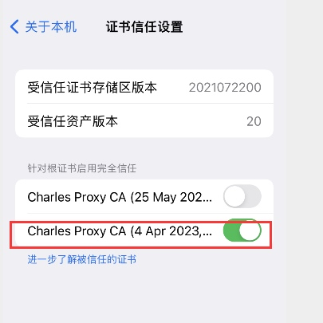

# charles 抓包

## 抓包概述
- 抓包概念
抓包是将网络传输发送与接收的数据包进行截获、重发、编辑、转存等操作，也用来检查网络安全等。
- 常见抓包工具

软件名称|简介|独立运行|支持移动设备|是否收费
-------|---|-------|---------|-
Fiddler|免费的HTTP查看工具|是|是|否
Charles|HTTP代理、HTTP监控、HTTP反代理、查看HTTP通讯、查看工作信息工具|	是|	是|	收费/免费
Wireshark|半免费，网络抓包、监听网卡，工作在网络接口层|是|否|
HttpWatch|集成到IE、Chrome中的网页数据分析工具|否|否|基础版/专业版
BurpSuite|Http代理,是用于攻击web应用程序的集成平台包含了许多工具：抓包、扫漏、爆破等。黑客必备|是|是|是

## 为什么要学习Charles抓包

- 能够使用Charles来分析前后端问题
- 能够使用Charles模拟弱网测试环境
- 能够使用Charles的断点构建异常的测试场景

## Charles简介
Charles中文名字青花瓷，是一款Http代理服务器和Http监视器，当移动端在无线网连接中按要求设置好代理服务器，使所有对网络的请求都经过Charles客户端来转发时，Charles可以监控这个客户端各个程序所有连接互联网的Http通信。

## Charles工作原理
截获真实客户端的HTTPS请求，伪装客户端向真实服务端发送HTTPS请求
接受真实服务器响应，用Charles自己的证书伪装服务端向真实客户端发送数据内容

## Charles主要功能
- 支持HTTP/HTTPS代理
- 支持流量控制
- 支持接口并发请求
- 支持重发网络请求，方便后端调试
- 支持断点调试
- 支持修改网络请求参数
- 支持网络请求的截获并动态修改
- 支持模拟慢速网络

## Charles 下载
下载：https://www.charlesproxy.com/latest-release/download.do

hack: https://www.zzzmode.com/mytools/charles/

## Charles 配置
- 证书安装
    - 根证书
    
    
    - 安装证书到remote device or web。

    
    
    
    
     通用 - 关于本机 - 证书信任设置
     
    

- 设置代理 

