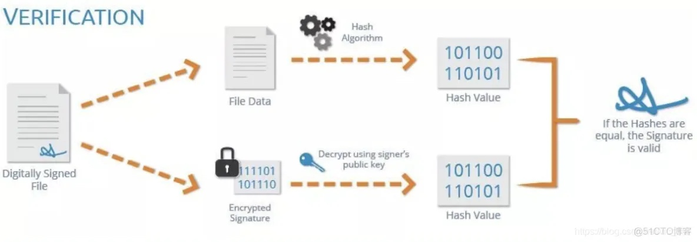

# android签名机制

## 背景知识

1. 消息摘要 ( Message Digest )
   
单向的Hash函数，生成一个固定长度的Hash值，这个Hash值即是消息摘要。不同的数据源，消息摘要肯定不一样。这个单向的Hash函数就是消息摘要算法。著名的数据摘要算法有RSA公司的MD5算法和SHA-1算法及其大量的变体。

消息摘要的主要特点：
- 无论输入的消息有多长，计算出来的消息摘要的长度总是固定的。例如，应用MD5算法摘要的消息有128个比特位，用SHA-1算法摘要的消息最终有160比特位的输出。
- 一般来说（不考虑碰撞的情况下），只要输入的原始数据不同，对其进行摘要以后产生的消息摘要也必不相同，即使原始数据稍有改变，输出的消息摘要便完全不同。但是，相同的输入必会产生相同的输出。
- 具有不可逆性，即只能进行正向的信息摘要，而无法从摘要中恢复出任何的原始消息。

```Java
//常用算法：MD5、SHA、CRC
MessageDigest digest = MessageDigest.getInstance("MD5");
byte[] result = digest.digest(content.getBytes());
//消息摘要的结果一般都是转换成16 进制字符串形式展示
String hex = Hex.encode(result);
//MD5 结果为16 字节（128 个比特位）、转换为16 进制表示后长度是32 个字符
//SHA 结果为20 字节（160 个比特位）、转换为16 进制表示后长度是40 个字符
System.out.println(hex);
```

2. 数字签名 ( Signature )

数字签名方案是一种以电子形式存储消息签名的方法，是非对称加密技术与数字摘要技术的一个具体的应用。

发送者先要生成一对公私钥对，将公钥给消息的接收者。发送者想给接收者发消息，在发送的信息中，除了要包含原始的消息外，还要加上另外一段消息。
- 发送的原始消息提取消息摘要；
- 提取的信息摘要用自己的私钥加密。

通过上面两成的消息，就是我们说的数字签名。

接收者接收到的信息，验证过程如下：
- 原始消息部分使用相同摘要算法提取消息摘要；
- 数字签名消息，使用预先得到的公钥解密；
- 比较上面两步各自所得到的两段内容息是否一致。如果一致，则表明消息确实是期望的发送者发的，且内容没有被篡改过；相反，如果不一致，则表明消息传送的过程中一定出了问题，消息不可信。

3. 数字证书 ( Certificate )

消息的接收者必须要事先得到正确的公钥。如果公钥就被别人篡改了，发送者给你发的消息会被你视作无效的。那么如何保证公钥的安全可信呢？这就要靠数字证书来解决了。签名文件和证书是成对出现的，二者不可分离。

数字证书的格式普遍采用的是X.509V3国际标准，一个标准的X.509数字证书通常包含以下内容：
- 证书的发布机构（Issuer）
- 证书的有效期（Validity）
- 证书所有人的公钥（Public-Key）
- 证书所有人的名称（Subject）
- 证书所使用的签名算法（Signature algorithm）
- 证书发行者对证书的数字签名（Thumbprint）

数字证书本身也用到了数字签名技术，只不过签名的内容是整个证书（里面包含了证书所有者的公钥以及其他一些内容）。与普通数字签名不同的是，数字证书的签名者不是随随便便一个普通机构，而是CA机构。一般来说，这些CA机构的根证书已经在设备出厂前预先安装到了你的设备上了。所以，数字证书可以保证证书里的公钥确实是这个证书所有者的，或者证书可以用来确认对方的身份。可见，数字证书主要是用来解决公钥的安全发放问题。

总结一下数字签名与验证的过程。

    数字签名：


    签名验证：



## Android签名流程

下面通过apk签名的流程来了解一下Android签名机制。

1. 签名工具（ jarsigner 与 signapk）

jarsigner和signapk。它们的签名算法没什么区别，主要是签名使用的文件不同。

- jarsigner：jdk自带的签名工具，可以对jar进行签名。使用keystore文件进行签名。生成的签名文件默认使用keystore的别名命名, 通过如下命令可以查看keystore文件信息。

`keytool -list -v -keystore /Users/victor/Downloads/debug.keystore`

- signapk：Android sdk提供的专门用于Android应用的签名工具。使用pk8、x509.pem文件进行签名。其中pk8是私钥文件，x509.pem是含有公钥的文件。生成的签名文件统一使用“CERT”命名。
- 
（因为这两个工具都是给apk签名的，所以keystore文件和pk8,x509.pem之间是是可以转化的。具体可以参考下面的链接。
   ）

2. 签名流程

我们通过一个apk来看看具体的签名流程。首先，通过解压apk包可以看到有如下内容。主要是看META-INF文件夹里面的。在META-INF文件夹下有三个文件：MANIFEST.MF、CERT.SF、CERT.RSA。它们就是签名过程中生成的文件，下面就逐一来了解一下这些文件在签名过程中发挥的作用。

- MANIFEST.MF
逐一遍历apk中的所有条目，如果是目录就跳过，如果是一个文件，就用SHA1（或者SHA256）消息摘要算法提取出该文件的摘要然后进行Base64编码后，作为“SHA1-Digest”属性的值写入到MANIFEST.MF文件中的一个块中。该块有一个“Name”属性， 其值就是该文件在apk包中的路径。

- CERT.SF
    和MANIFEST.MF的内容差不多，但是多了一些条目。里面的属性对应的字段如下表所示。


|名称|说明
|-|-
|Signature-Version: 1.0 Created-By: 1.0 (Android) X-Android-APK-Signed: 2 |版本信息
|SHA1-Digest-Manifest: lHTFY2hWhZevjuV1qSDhq2cDJU8=|对MANIFEST.MF整个文件进行消息摘要结果的Base64编码，消息摘要采用SHA1算法

- CERT.RSA
 二进制文件，因为RSA文件加密了，需要用openssl命令。
`openssl pkcs7 -inform DER -in CERT.RSA -text -noout -print_certs`


上面的这些信息，可以对应下图：


这里会把之前生成的CERT.SF文件，用私钥计算出签名, 然后将签名以及包含公钥信息的数字证书一同写入 CERT.RSA 中保存。


- 签名过程：


apk的保护链是 CERT.RSA -> CERT.SF -> MANIFEST.MF -> 包中的每一个文件。

- 签名验证过程： 
    签名验证是发生在apk的安装过程中，一共分为三步：
    1）检查apk中包含的所有文件，对应的摘要值与MANIFEST.MF文件中记录的值一致。
    2）使用证书文件（RSA文件）检验签名文件（SF文件）没有被修改过。
    3）使用签名文件（SF文件）检验MF文件没有被修改过。


