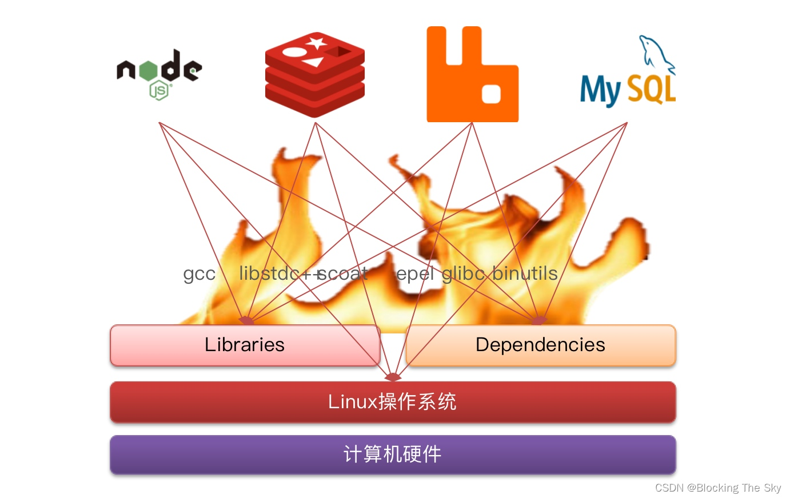
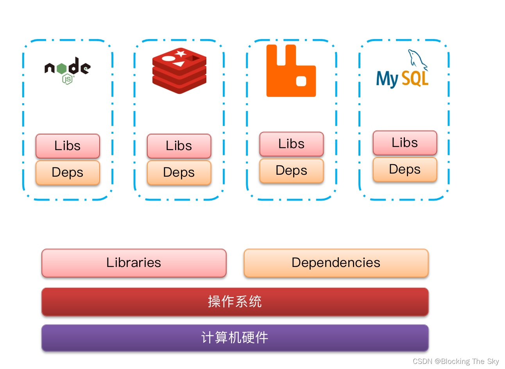
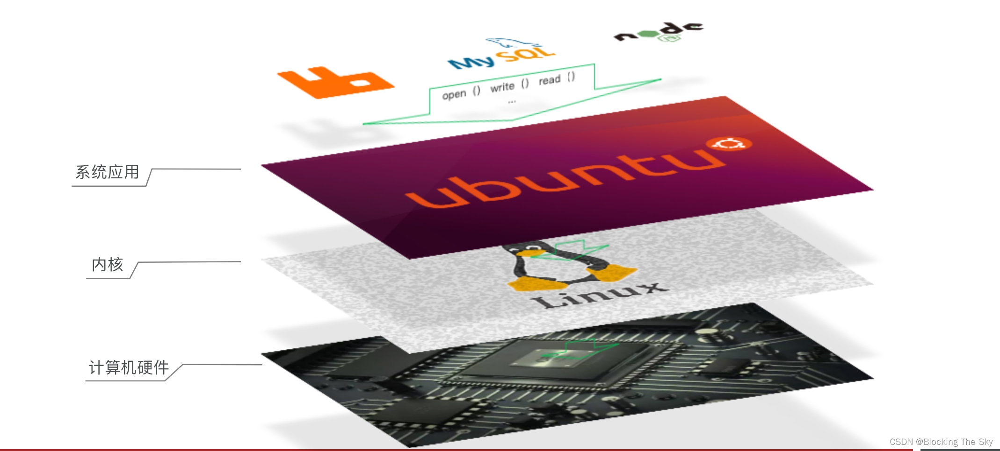
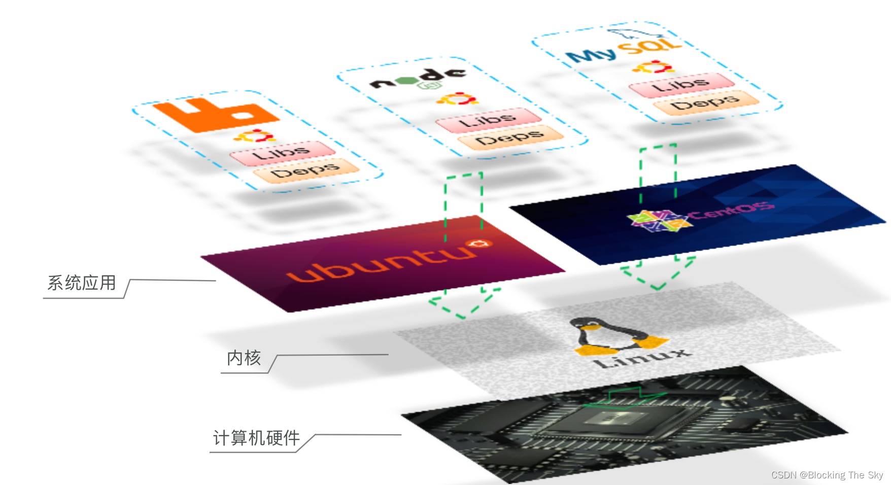
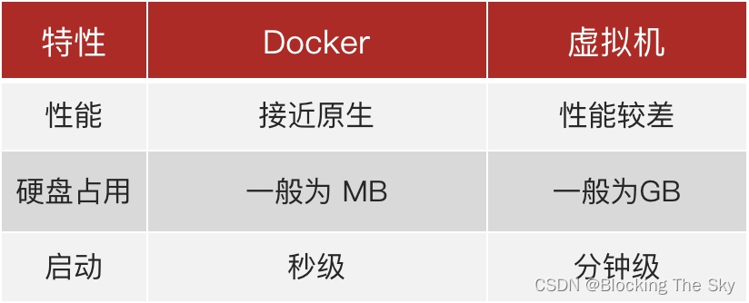

# Docker Introuce

## 什么是Docker
大型项目组件较多，运行环境也较为复杂，部署时会碰到一些问题：
- 依赖关系复杂，容易出现兼容性问题
- 开发、测试、生产环境有差异

Docker就是来解决这些问题的。Docker是一个快速交付应用、运行应用的技术：可以将程序及其依赖、运行环境一起打包为一个镜像，可以迁移到任意Linux操作系统。运行时利用沙箱机制形成隔离容器，各个应用互不干扰启动、移除都可以通过一行命令完成，方便快捷。

### Docker如何解决依赖的兼容问题的？
- 将应用的Libs（函数库）、Deps（依赖）、配置与应用一起打包
- 将每个应用放到一个隔离容器去运行，避免互相干扰

### 不同环境的操作系统不同，Docker如何解决？我们先来了解下操作系统结构
- 内核与硬件交互，提供操作硬件的指令
- 系统应用封装内核指令为函数，便于程序员调用
- 用户程序基于系统函数库实现功能

Ubuntu和CentOS都是基于Linux内核，只是系统应用不同，提供的函数库有差异。

- Docker将用户程序与所需要调用的系统(比如Ubuntu)函数库一起打包。
- Docker运行到不同操作系统时，直接基于打包的库函数，借助于操作系统的Linux内核来运行。

### Docker如何解决大型项目依赖关系复杂，不同组件依赖的兼容性问题？

- Docker允许开发中将应用、依赖、函数库、配置一起打包，形成可移植镜像。
- Docker应用运行在容器中，使用沙箱机制，相互隔离。
- Docker如何解决开发、测试、生产环境有差异的问题？
- Docker镜像中包含完整运行环境，包括系统函数库，仅依赖系统的Linux内核，因此可以在任意Linux操作系统上运行。

## Docker与虚拟机
虚拟机（virtual machine）是在操作系统中模拟硬件设备，然后运行另一个操作系统，比如在 Windows 系统里面运行 Ubuntu 系统，这样就可以运行任意的Ubuntu应用了。

Docker与虚拟机的比较：

Docker和虚拟机的差异：

- docker是一个系统进程；虚拟机是在操作系统中的操作系统。
- docker体积小、启动速度快、性能好；虚拟机体积大、启动速度慢、性能一般。

## 镜像和容器
- 镜像（Image）：
Docker将应用程序及其所需的依赖、函数库、环境、配置等文件打包在一起，称为镜像。
- 容器（Container）：
镜像中的应用程序运行后形成的进程就是容器，只是Docker会给容器做隔离，对外不可见。

## Docker架构
Docker是一个CS架构的程序，由两部分组成：

- 服务端(server)：Docker守护进程，负责处理Docker指令，管理镜像、容器等
- 客户端(client)：通过命令或RestAPI向Docker服务端发送指令。可以在本地或远程向服务端发送指令。

