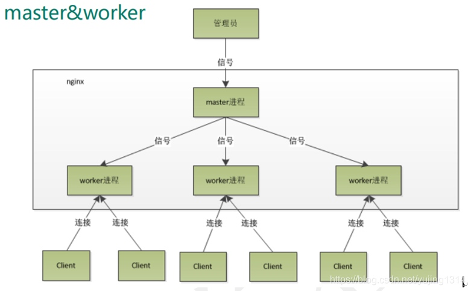
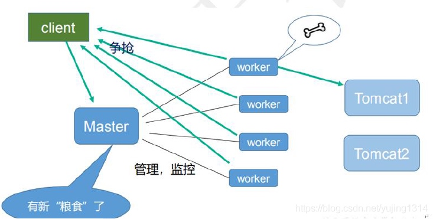
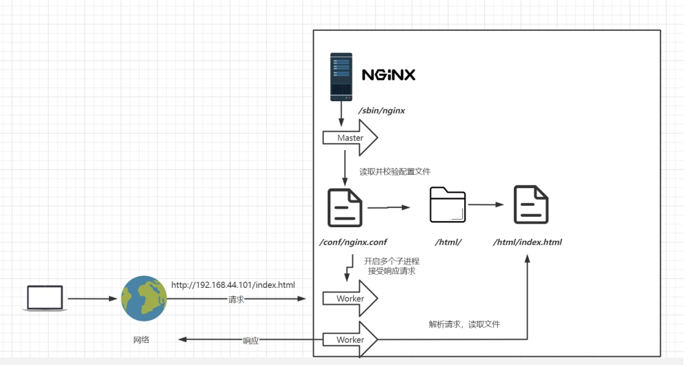
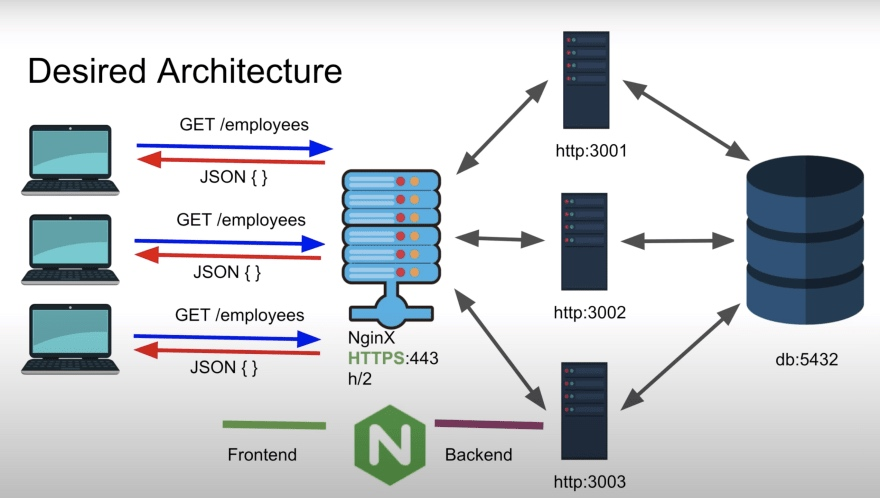
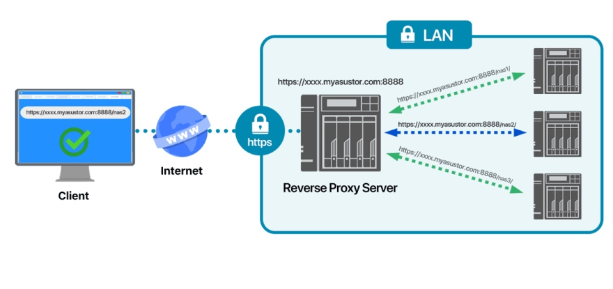
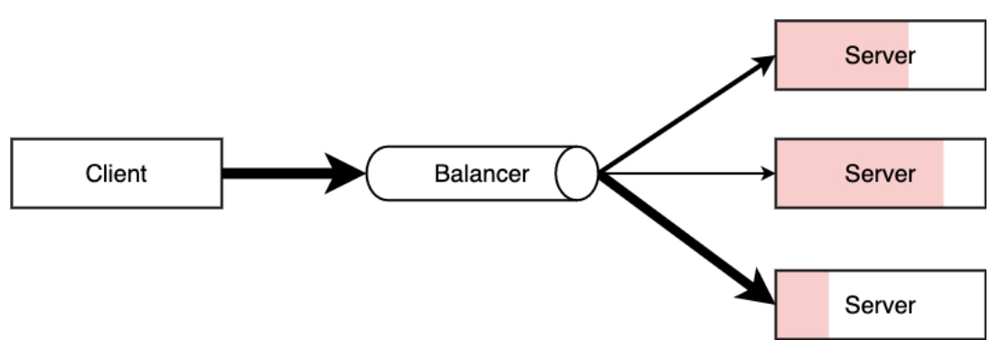
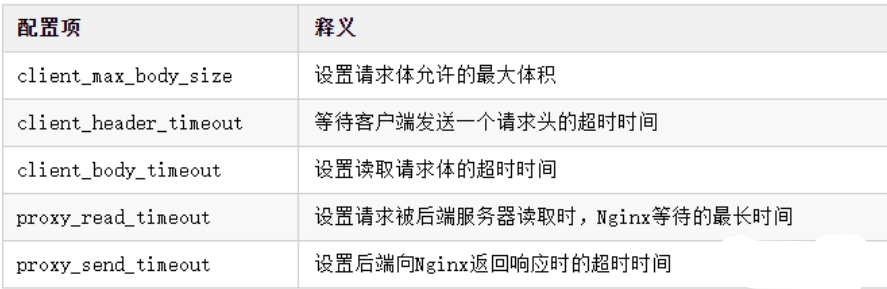

# nginx 详解

## 介绍
Nginx---Ngine X，是一款免费的、自由的、开源的、高性能HTTP服务器和反向代理服务器；也是一个IMAP、POP3、SMTP代理服务器；Nginx以其高性能、稳定性、丰富的功能、简单的配置和低资源消耗而闻名。也就是说Nginx本身就可以托管网站（类似于Tomcat一样），进行Http服务处理，也可以作为反向代理服务器 、负载均衡器和HTTP缓存。

Nginx 解决了服务器的C10K（就是在一秒之内连接客户端的数目为10k即1万）问题。它的设计不像传统的服务器那样使用线程处理请求，而是一个更加高级的机制—事件驱动机制，是一种异步事件驱动结构。

## 优点

* 更快 这表现在两个方面：一方面，在正常情况下，单次请求会得到更快的响应；另一方面，在高峰期（如有数以万计的并发请求），Nginx可以比其他Web服务器更快地响应请求。
* 高扩展性,跨平台Nginx的设计极具扩展性，它完全是由多个不同功能、不同层次、不同类型且耦合度极低的模块组成。
* 高可靠性：用于反向代理，宕机的概率微乎其微 高可靠性是我们选择Nginx的最基本条件，因为Nginx的可靠性是大家有目共睹的，很多家高流量网站都在核心服务器上大规模使用Nginx。Nginx的高可靠性来自于其核心框架代码的优秀设计、模块设计的简单性；另外，官方提供的常用模块都非常稳定，每个worker进程相对独立，master进程在1个worker进程出错时可以快速“拉起”新的worker子进程提供服务。
* 低内存消耗 一般情况下，10000个非活跃的HTTP Keep-Alive连接在Nginx中仅消耗2.5MB的内存，这是Nginx支持高并发连接的基础。
* 单机支持10万以上的并发连接 这是一个非常重要的特性！随着互联网的迅猛发展和互联网用户数量的成倍增长，各大公司、网站都需要应付海量并发请求，一个能够在峰值期顶住10万以上并发请求的Server，无疑会得到大家的青睐。理论上，Nginx支持的并发连接上限取决于内存，10万远未封顶。当然，能够及时地处理更多的并发请求，是与业务特点紧密相关的。
* 热部署master管理进程与worker工作进程的分离设计，使得Nginx能够提供热部署功能，即可以在7×24小时不间断服务的前提下，升级Nginx的可执行文件。当然，它也支持不停止服务就更新配置项、更换日志文件等功能。
* 最自由的BSD许可协议 这是Nginx可以快速发展的强大动力。BSD许可协议不只是允许用户免费使用Nginx,它还允许用户在自己的项目中直接使用或修改Nginx源码,然后发布。

## Nginx是如何处理一个HTTP请求的呢？
* 多进程机制
  服务器每当收到一个客户端时,就有服务器主进程 (master process) 生成一个子进程(worker process)出来和客户端建立连接进行交互,直到连接断开，该子进程就结束了。使用进程的好处是各个进程之间相互独立,不需要加锁,减少了使用锁对性能造成影响,同时降低编程的复杂度,降低开发成本。其次，采用独立的进程，可以让进程互相之间不会影响 ,如果一个进程发生异常退出时，其它进程正常工作,master 进程则很快启动新的worker 进程，确保服务不会中断，从而将风险降到最低。缺点是操作系统生成一个子进程需要进行内存复制等操作,在资源和时间上会产生一定的开销。当有大量请求时，会导致系统性能下降。  
  
  

* 异步非阻塞机制
  每个工作进程 使用 异步非阻塞方式 ，可以处理多个客户端请求 。当某个工作进程 接收到客户端的请求以后，调用 IO 进行处理，如果不能立即得到结果，就去 处理其他请求 （即为 非阻塞 ）；而 客户端 在此期间也 无需等待响应 ，可以去处理其他事情（即为 异步 ）。当 IO 返回时，就会通知此 工作进程 ；该进程得到通知，暂时挂起当前处理的事务去响应客户端请求 。
  
 

**worker 数应该和 CPU 数相等；一个 master 多个 worker 可以使用热部署，同时 worker 是独立的，一个挂了不会影响其他的。**


## 重要的使用场景：
* 静态资源服务，通过本地文件系统提供服务；
* 反向代理服务，延伸出包括缓存、负载均衡等；
* API 服务，OpenResty；

## Nginx 安装

* Linux 安装Nginx
 
* Docker 安装Nginx

```bash
docker run  --name nginx \
--network host \
--privileged=true \
--restart=always \
-v /mydata/nginx/html:/usr/share/nginx/html \
-v /mydata/nginx/logs:/var/log/nginx  \
-v /mydata/nginx/conf:/etc/nginx \
-d nginx
```

## Nginx 运行基本原理






## Nginx 配置文件

### 默认nginx.conf 配置文件
nginx主要的配置文件为/etc/nginx/nginx.conf文件，内部结构大体如下：

```主要包含三大块
main        # 全局配置，对全局生效，即最外层的配置
├── events  # 配置影响 Nginx 服务器或与用户的网络连接
├── http    # 配置代理，缓存，日志定义等绝大多数功能和第三方模块的配置
│   ├── upstream # 配置后端服务器具体地址，负载均衡配置不可或缺的部分
│   ├── server   # 配置虚拟主机的相关参数，一个 http 块中可以有多个 server 块
│   ├── server
│   │   ├── location  # server 块可以包含多个 location 块，location 指令用于匹配 uri
│   │   ├── location
│   │   └── ...
│   └── ...
└── ...
```
一个 Nginx 配置文件的结构就像 nginx.conf 显示的那样，配置文件的语法规则：

* 配置文件由指令与指令块构成；
* 每条指令以 ; 分号结尾，指令与参数间以空格符号分隔；
* 指令块以 {} 大括号将多条指令组织在一起；
* include 语句允许组合多个配置文件以提升可维护性；
* 使用 # 符号添加注释，提高可读性；
* 使用 $ 符号使用变量；
* 部分指令的参数支持正则表达式；


```nginx
## main 全局块
user  nginx;				 # 以nignx用户运行
worker_processes  auto; # Nginx 进程数，auto为自动调节

error_log  /var/log/nginx/error.log notice;   # Nginx 的错误日志存放目录
pid        /var/run/nginx.pid;		# Nginx 服务启动时的 pid 存放位置

## events 块
events {
    worker_connections  1024;   # 每个进程允许最大并发数
}

# http 块 配置最频繁的部分，代理、缓存、日志等大部分功能和第三方配置
http {
    include       /etc/nginx/mime.types;     # 文件扩展名与对应的映射表，即http mime类型
    default_type  application/octet-stream;  # 如果mime类型没匹配上，默认使用二进制流的方式传输。

  	# 设置日志的记录格式 
    log_format  main  '$remote_addr - $remote_user [$time_local] "$request" '
                      '$status $body_bytes_sent "$http_referer" ' 
                      '"$http_user_agent" "$http_x_forwarded_for"';

    access_log  /var/log/nginx/access.log  main;  # Nginx 访问日志记录位置

    # sendfile      on;				# 开启高效传输模式，也就是数据0拷贝
    # tcp_nopush    on;				# 减少网络报文段的数量

    keepalive_timeout  65;    # 保持连接的时间，也称为超时时间，单位秒

    include /etc/nginx/conf.d/*.conf;    # 最后会加载conf.d 文件夹下的配置文件

   	# /etc/nginx/conf.d/default.conf
    server {
        listen       80;   	      # 监听端口
        server_name  localhost;		# 配置域名

        location / {					   # 匹配请求网址
            root   /usr/share/nginx/html;		       # 网址根目录，且全局有且仅有一个root
            index  index.html index.htm;		      # 默认首页文件
        		deny 172.168.22.11;   # 禁止访问的ip地址，可以为all
        		allow 172.168.33.44； # 允许访问的ip地址，可以为all
        }
    
        #error_page  404              /404.html;  # 404 状态码显示的网页
    
        # redirect server error pages to the static page /50x.html
        #
        error_page  500 502 503 504  /50x.html; # http状态码为50x的时候对应的页面 
        location = /50x.html {
            root   /usr/share/nginx/html;
        }
    }
}

```

server 块中可以包含多个location，每个location 支持正则匹配
### 匹配规则

* = 精确匹配路径，用于不含正则表达式的 uri 前，如果匹配成功，不再进行后续的查找；
* ^~ 用于不含正则表达式的 uri 前，表示如果该符号后面的字符是最佳匹配，采用该规则，不再进行后续的查找；
* ~ 表示用该符号后面的正则去匹配路径，区分大小写；
* ~* 表示用该符号后面的正则去匹配路径，不区分大小写。跟 ~ 优先级都比较低，如有多个location的正则能匹配的话，则使用正则表达式最长的那个；
* 如果 url 包含正则表达式，则必须要有 ~ 或 ~* 标志。

### Nginx 全局变量

* $remote_addr        //获取客户端ip
* $binary_remote_addr //客户端ip（二进制)
* $remote_port        //客户端port，如：50472
* $remote_user        //已经经过Auth Basic Module验证的用户名
* $host           //请求主机头字段，否则为服务器名称，如:blog.sakmon.com
* $request        //用户请求信息，如：GET ?a=1&b=2 HTTP/1.1
* $request_filename   //当前请求的文件的路径名，由root或alias和URI request组合而成，如：/2013/81.html
* $status         //请求的响应状态码,如:200
* $body_bytes_sent  // 响应时送出的body字节数数量。即使连接中断，这个数据也是精确的,如：40
* $content_length        // 等于请求行的“Content_Length”的值
* $content_type          // 等于请求行的“Content_Type”的值
* $http_referer          // 引用地址
* $http_user_agent      // 客户端agent信息,如：Mozilla/5.0 (Windows NT 5.1) AppleWebKit/537.36 (KHTML, like Gecko) Chrome/29.0.1547.76 Safari/537.36
* $args            //与$query_string相同 等于当中URL的参数(GET)，如a=1&b=2
* $document_uri        //与$uri相同  这个变量指当前的请求URI，不包括任何参数(见$args) 如:/2013/81.html
* $document_root       //针对当前请求的根路径设置值
* $hostname        //如：centos53.localdomain
* $http_cookie        //客户端cookie信息
* $cookie_COOKIE      //cookie COOKIE变量的值
* $is_args    //如果有$args参数，这个变量等于”?”，否则等于”"，空值，如?
* $limit_rate //这个变量可以限制连接速率，0表示不限速
* $query_string       // 与$args相同 等于当中URL的参数(GET)，如a=1&b=2
* $request_body      // 记录POST过来的数据信息
* $request_body_file  //客户端请求主体信息的临时文件名
* $request_method       //客户端请求的动作，通常为GET或POST,如：GET
* $request_uri          //包含请求参数的原始URI，不包含主机名，如：/2013/81.html?a=1&b=2
* $scheme            //HTTP方法（如http，https）,如：http
* $uri            //这个变量指当前的请求URI，不包括任何参数(见$args) 如:/2013/81.html
* $request_completion //如果请求结束，设置为OK. 当请求未结束或如果该请求不是请求链串的最后一个时，为空(Empty)，如：OK
* $server_protocol    //请求使用的协议，通常是HTTP/1.0或HTTP/1.1，如：HTTP/1.1
* $server_addr        //服务器IP地址，在完成一次系统调用后可以确定这个值
* $server_name        //服务器名称，如：blog.sakmon.com
* $server_port        //请求到达服务器的端口号,如：80


## Nginx 代理

### 正向代理（forward proxy）
正常情况下，用户要访问网站直接访问即可，此时用户不想让对方服务器知道自己的信息（比如自己的IP等），就可以通过配置代理服务器，让我们的代理服务器来代替我们发送请求获取数据，并将数据返回给我们。这就叫做正向代理
正向代理隐藏了真实的客户端信息，对方服务器获取的都是代理服务器的信息


### 反向代理（Reverse Proxy）
当用户访问网站时，使用反向代理服务器之后，用户访问的是我们的代理服务器，而代理服务器会根据nginx配置项来请求真正的服务器，nginx将获取的数据返回给用户。
反向代理隐藏了服务器信息，在处理跨域时比较常用。




### location 配置（带/ 和 不带/ 的区别）
* 若location 结尾不带 / ，表示模糊匹配，只要location 开头能匹配上，后面的内容是否有多余都会匹配成功。
* 若location 结尾带 /， 表示只能匹配location 结尾指定内容，匹配内容结尾可以不包含/
* 若url 结尾不带 / ，则会把location 匹配的内容追加到后面
* 若url结尾带 / ，则会将location匹配的内容替换为 url / 后的内容。

**实际项目开发中，location 往往是以/结尾的。url 也往往是以/ 结尾，这样能够有效保障精确的匹配api，并后端服务能够正确的处理。**


### location 优先级


| 匹配符  | 匹配规则           | 优先级 |
|------|----------------|-----|
| \=   | 精确匹配           | 1   |
| ^~   | 以某个字符串开头       | 2   |
| ～    | 区分大小写的正则匹配     | 3   |
| ～\*  | 不区分大小写正则匹配     | 4   |
| ！～   | 区分大小写不匹配的正则    | 5   |
| ！～\* | 不区分大小写不匹配的正则   | 6   |
| /    | 通用匹配，任何请求都会匹配到 | 7   |

```nginx
# 优先级1,精确匹配，根路径
location =/ {
    return 400;
}

# 优先级2,以某个字符串开头,以av开头的，优先匹配这里，区分大小写
location ^~ /av {
   root /data/av/;
}

# 优先级3，区分大小写的正则匹配，匹配/media*****路径
location ~ /media {
      alias /data/static/;
}

# 优先级4 ，不区分大小写的正则匹配，所有的****.jpg|gif|png 都走这里
location ~* .*\.(jpg|gif|png|js|css)$ {
   root  /data/av/;
}

# 优先7，通用匹配
location / {
    return 403;
}
```

### root & alias 指令

 Nginx 中，alias 和 root 都是用于指定服务器文件系统中的路径的指令，但它们在处理请求时的行为略有不同。
 
 1. root 指令：
root 指令用于指定服务器文件系统中的根目录，它会将请求的 URI 与该目录结合，构建出完整的文件路径。

```nginx
server {
    listen 80;
    server_name example.com;

    root /path/to/your/website;

    location / {
        index index.html;
    }
}
```

在 Nginx 中，alias 和 root 都是用于指定服务器文件系统中的路径的指令，但它们在处理请求时的行为略有不同。

1. **root** 指令：
   root 指令用于指定服务器文件系统中的根目录，它会将请求的 URI 与该目录结合，构建出完整的文件路径。

```nginx
server {
    listen 80;
    server_name example.com;

    root /path/to/your/website;

    location / {
        index index.html;
    }
}
```
在上面的例子中，所有请求的根路径将映射到 /path/to/your/website 目录。例如，对于请求 http://example.com/page.html，实际文件路径将为 /path/to/your/website/page.html。

1. **alias** 指令：
   alias 指令用于指定服务器文件系统中的路径，但它会使用该路径替换请求的 URI 中匹配 location 中的部分。

```nginx
server {
    listen 80;
    server_name example.com;

   location /static/ {
        alias /path/to/static/files/;
        index index.html;
    }
}
```
 在上面的例子中，请求 http://example.com/static/image.jpg 将映射到文件 /path/to/static/files/image.jpg。alias 会将匹配 location 的部分（在这里是 /static/）替换为指定的路径。
 
#### 区别：
* root：
    * root 会将请求的 URI 附加到指定的根目录，用于构建文件路径。
    * 适用于简单的静态文件服务或基本的网站。
    * 文件路径是 root + URI。
* alias：
    * alias 会替换 location 中匹配的部分，然后再附加到指定的路径。
    * 适用于需要根据 URI 重定向请求到不同路径的情况，比如静态文件服务。
    * 文件路径是 指定的路径。

选择使用 root 还是 alias 取决于你的具体需求，通常情况下，root 更适合基本的 Web 服务，而 alias 更适合在 URI 中重定向请求到不同路径的情况。    

### 动静分离

```nginx
location ~ .*\.(html|htm|gif|jpg|jpeg|bmp|png|ico|txt|js|css){  
    root   /nginx/static_resources;  
    expires 7d;  
}
```


## 负载均衡

在早期，用户访问量不大的时候，用户每次请求，nginx将服务器响应的数据返回给用户，当用户访问越来越多时，服后端务器开始处理不过来，此时我们可以配置多台服务器，当A服务器负载较高时，nginx将请求转发到B服务器来响应用户，这样就能保障用户访问时的快速响应。


```nginx
# 当请求过来时，nginx 判断每台服务器的负载情况来决定请求转发到哪台服务器
upstream my-srv {
    server 127.0.0.1:8000 weight=2; 
    server 127.0.0.1:8001 weight=1;
}

server {
    listen  8080;
    server_name demo.srv;
    location / {
        proxy_pass http://my-srv;
    }
}

```
参数介绍：
* down：表示当前的server暂时不参与负载
* weight：默认为1.weight越大，负载的权重就越大。
* backup： 其它所有的非backup机器down或者忙的时候，请求backup机器。


## 限流 

Nginx限流就是限制用户请求速度，防止服务器负载过大

限流有3种

* 正常限制访问频率（正常流量）
* 突发限制访问频率（突发流量）
* 限制并发连接数
Nginx的限流都是基于漏桶流算法

实现三种限流算法

### 正常限制访问频率（正常流量）：

限制一个用户发送的请求，我Nginx多久接收一个请求。

Nginx中使用ngx_http_limit_req_module模块来限制的访问频率，限制的原理实质是基于漏桶算法原理来实现的。在nginx.conf配置文件中可以使用limit_req_zone命令及limit_req命令限制单个IP的请求处理频率。

``` nginx
# 定义限流维度，一个用户一分钟一个请求进来，多余的全部漏掉
limit_req_zone $binary_remote_addr zone=one:10m rate=1r/m;

# 绑定限流维度
server{
    
    location/seckill.html{
        limit_req zone=zone;    
        proxy_pass http://lj_seckill;
    }

}

```
1r/s代表1秒一个请求，1r/m一分钟接收一个请求， 如果Nginx这时还有别人的请求没有处理完，Nginx就会拒绝处理该用户请求。

### 突发限制访问频率（突发流量）：

限制一个用户发送的请求，我Nginx多久接收一个。

上面的配置一定程度可以限制访问频率，但是也存在着一个问题：如果突发流量超出请求被拒绝处理，无法处理活动时候的突发流量，这时候应该如何进一步处理呢？

Nginx提供burst参数结合nodelay参数可以解决流量突发的问题，可以设置能处理的超过设置的请求数外能额外处理的请求数。我们可以将之前的例子添加burst参数以及nodelay参数：

```nginx
# 定义限流维度，一个用户一分钟一个请求进来，多余的全部漏掉
limit_req_zone $binary_remote_addr zone=one:10m rate=1r/m;

# 绑定限流维度
server{
    
    location/seckill.html{
        limit_req zone=zone burst=5 nodelay;
        proxy_pass http://lj_seckill;
    }

}
```
为什么就多了一个 burst=5 nodelay; 呢，多了这个可以代表Nginx对于一个用户的请求会立即处理前五个，多余的就慢慢来落，没有其他用户的请求我就处理你的，有其他的请求的话我Nginx就漏掉不接受你的请求

### 限制并发连接数
Nginx中的ngx_http_limit_conn_module模块提供了限制并发连接数的功能，可以使用limit_conn_zone指令以及limit_conn执行进行配置。接下来我们可以通过一个简单的例子来看下：

```nginx
http {
    limit_conn_zone $binary_remote_addr zone=myip:10m;
    limit_conn_zone $server_name zone=myServerName:10m;
}

server {
    location / {
        limit_conn myip 10;
        limit_conn myServerName 100;
        rewrite / http://www.lijie.net permanent;
    }
} 
```
上面配置了单个IP同时并发连接数最多只能10个连接，并且设置了整个虚拟服务器同时最大并发数最多只能100个链接。当然，只有当请求的header被服务器处理后，虚拟服务器的连接数才会计数。刚才有提到过Nginx是基于漏桶算法原理实现的，实际上限流一般都是基于漏桶算法和令牌桶算法实现的。

## 漏桶流算法和令牌桶算法

漏桶算法
漏桶算法思路很简单，我们把水比作是请求，漏桶比作是系统处理能力极限，水先进入到漏桶里，漏桶里的水按一定速率流出，当流出的速率小于流入的速率时，由于漏桶容量有限，后续进入的水直接溢出（拒绝请求），以此实现限流。


令牌桶算法
令牌桶算法的原理也比较简单，我们可以理解成医院的挂号看病，只有拿到号以后才可以进行诊病。

系统会维护一个令牌（token）桶，以一个恒定的速度往桶里放入令牌（token），这时如果有请求进来想要被处理，则需要先从桶里获取一个令牌（token），当桶里没有令牌（token）可取时，则该请求将被拒绝服务。令牌桶算法通过控制桶的容量、发放令牌的速率，来达到对请求的限制。


## Nginx 开启压缩
开启nginx gzip压缩后，网页、css、js等静态资源的大小会大大的减少，从而可以节约大量的带宽，提高传输效率，给用户快的体验。虽然会消耗cpu资源，但是为了给用户更好的体验是值得的。

开启的配置如下：
```nginx
http {
  # 开启gzip
  gzip on;
 
  # 启用gzip压缩的最小文件；小于设置值的文件将不会被压缩
  gzip_min_length 1k;
 
  # gzip 压缩级别 1-10 
  gzip_comp_level 2;
 
  # 进行压缩的文件类型。
  gzip_types text/plain application/javascript application/x-javascript text/css application/xml text/javascript application/x-httpd-php image/jpeg image/gif image/png;
 
  # 是否在http header中添加Vary: Accept-Encoding，建议开启
  gzip_vary on;
}

```

以下类型的资源不建议启用压缩
* 图片类型
* 大文件

## Nginx缓冲区
接入Nginx的项目一般请求流程为：“客户端→Nginx→服务端”，在这个过程中存在两个连接：“客户端→Nginx、Nginx→服务端”，那么两个不同的连接速度不一致，就会影响用户的体验（比如浏览器的加载速度跟不上服务端的响应速度）。

其实也就类似电脑的内存跟不上CPU速度，所以对于用户造成的体验感极差，因此在CPU设计时都会加入三级高速缓冲区，用于缓解CPU和内存速率不一致的矛盾。在Nginx也同样存在缓冲区的机制，主要目的就在于：「「用来解决两个连接之间速度不匹配造成的问题」」 ，有了缓冲后，Nginx代理可暂存后端的响应，然后按需供给数据给客户端。

```nginx
http{  
    proxy_connect_timeout 10;  #设置与后端服务器建立连接时的超时时间。
    proxy_read_timeout 120;    #设置从后端服务器读取响应数据的超时时间。
    proxy_send_timeout 10;     #设置向后端服务器传输请求数据的超时时间。 
    proxy_buffering on;  # 是否启用缓冲机制，默认为on关闭状态。
    client_body_buffer_size 512k;  # 设置缓冲客户端请求数据的内存大小。
    proxy_buffers 4 64k;  # 为每个请求/连接设置缓冲区的数量和大小，默认4 4k/8k。
    proxy_buffer_size 16k;  # 设置用于存储响应头的缓冲区大小
    proxy_busy_buffers_size 128k;  # 在后端数据没有完全接收完成时，Nginx可以将busy状态的缓冲返回给客户端，该参数用来设置busy状态的buffer具体有多大，默认为proxy_buffer_size*2。
    proxy_temp_file_write_size 128k;  # 设置每次写数据到临时文件的大小限制。
    proxy_temp_path /soft/nginx/temp_buffer; # 当内存缓冲区存满时，可以将数据临时存放到磁盘，该参数是设置存储缓冲数据的目录。
}
```

**上述的缓冲区参数，是基于每个请求分配的空间，而并不是所有请求的共享空间。当然，具体的参数值还需要根据业务去决定，要综合考虑机器的内存以及每个请求的平均数据大小**

## Nginx缓存机制

对于性能优化而言，缓存是一种能够大幅度提升性能的方案，因此几乎可以在各处都能看见缓存，如客户端缓存、代理缓存、服务器缓存等等，Nginx的缓存则属于代理缓存的一种。对于整个系统而言，加入缓存带来的优势额外明显：

* 减少了再次向后端或文件服务器请求资源的带宽消耗。
* 降低了下游服务器的访问压力，提升系统整体吞吐。
* 缩短了响应时间，提升了加载速度，打开页面的速度更快。

```nginx
http{  
    # 设置缓存的目录，并且内存中缓存区名为hot_cache，大小为128m，  
    # 三天未被访问过的缓存自动清楚，磁盘中缓存的最大容量为2GB。
    proxy_cache_path /soft/nginx/cache levels=1:2 keys_zone=hot_cache:128m inactive=3d max_size=2g;  
      
    server{  
        location / {  
            # 使用名为nginx_cache的缓存空间  
            proxy_cache hot_cache;  
            # 对于200、206、304、301、302状态码的数据缓存1天  
            proxy_cache_valid 200 206 304 301 302 1d;  
            # 对于其他状态的数据缓存30分钟  
            proxy_cache_valid any 30m;  
            # 定义生成缓存键的规则（请求的url+参数作为key）  
            proxy_cache_key $host$uri$is_args$args;  
            # 资源至少被重复访问三次后再加入缓存  
            proxy_cache_min_uses 3;  
            # 出现重复请求时，只让一个去后端读数据，其他的从缓存中读取  
            proxy_cache_lock on;  
            # 上面的锁超时时间为3s，超过3s未获取数据，其他请求直接去后端  
            proxy_cache_lock_timeout 3s;  
            # 对于请求参数或cookie中声明了不缓存的数据，不再加入缓存  
            proxy_no_cache $cookie_nocache $arg_nocache $arg_comment;  
            # 在响应头中添加一个缓存是否命中的状态（便于调试）  
            add_header Cache-status $upstream_cache_status;  
        }  
    }  
}
```

### 缓存清理

当缓存过多时，如果不及时清理会导致磁盘空间被“吃光”，因此我们需要一套完善的缓存清理机制去删除缓存。

我们可以通过强大的第三方模块ngx_cache_purge来替代，先来安装一下该插件：

```bash

1. Nginx的安装目录下，创建一个cache_purge目录：

mkdir cache_purge && cd cache_purge

1. 通过wget指令从github上拉取安装包的压缩文件并解压：

wget https://github.com/FRiCKLE/ngx_cache_purge/archive/2.3.tar.gz  
tar -xvzf 2.3.tar.gz  

3. 再次去到之前Nginx的解压目录下：
cd /soft/nginx/nginx1.21.6  

4. 重新构建一次Nginx，通过--add-module的指令添加刚刚的第三方模块：
./configure --prefix=/soft/nginx/ --add-module=/soft/nginx/cache_purge/ngx_cache_purge-2.3/  

5. 重新根据刚刚构建的Nginx，再次编译一下，「但切记不要make install」 ：
make  
6. 删除之前Nginx的启动文件，不放心的也可以移动到其他位置：

 rm -rf /soft/nginx/sbin/nginx  
7. 从生成的objs目录中，重新复制一个Nginx的启动文件到原来的位置：

[root@localhost]# cp objs/nginx /soft/nginx/sbin/nginx  
```
至此，第三方缓存清除模块ngx_cache_purge就安装完成了，接下来稍微修改一下nginx.conf配置，再添加一条location规则：

```nginx
location ~ /purge(/.*) {  
  # 配置可以执行清除操作的IP（线上可以配置成内网机器）  
  # allow 127.0.0.1; # 代表本机  
  allow all; # 代表允许任意IP清除缓存  
  proxy_cache_purge $host$1$is_args$args;  
}  
```
然后再重启Nginx，接下来即可通过http://xxx/purge/xx的方式清除缓存。

## Nginx实现IP黑白名单

有时候往往有些需求，可能某些接口只能开放给对应的合作商，或者购买/接入API的合作伙伴，那么此时就需要实现类似于IP白名单的功能。而有时候有些恶意攻击者或爬虫程序，被识别后需要禁止其再次访问网站，因此也需要实现IP黑名单。那么这些功能无需交由后端实现，可直接在Nginx中处理。

Nginx做黑白名单机制，主要是通过allow、deny配置项来实现：

```nginx
allow xxx.xxx.xxx.xxx; # 允许指定的IP访问，可以用于实现白名单。  
deny xxx.xxx.xxx.xxx; # 禁止指定的IP访问，可以用于实现黑名单。  
```

要同时屏蔽/开放多个IP访问时，如果所有IP全部写在nginx.conf文件中定然是不显示的，这种方式比较冗余，那么可以新建两个文件BlocksIP.conf、WhiteIP.conf：

```conf
# --------黑名单：BlocksIP.conf---------  
deny 192.177.12.222; # 屏蔽192.177.12.222访问  
deny 192.177.44.201; # 屏蔽192.177.44.201访问  
deny 127.0.0.0/8; # 屏蔽127.0.0.1到127.255.255.254网段中的所有IP访问  
  
# --------白名单：WhiteIP.conf---------  
allow 192.177.12.222; # 允许192.177.12.222访问  
allow 192.177.44.201; # 允许192.177.44.201访问  
allow 127.45.0.0/16; # 允许127.45.0.1到127.45.255.254网段中的所有IP访问  
deny all; # 除开上述IP外，其他IP全部禁止访问  
```

分别将要禁止/开放的IP添加到对应的文件后，可以再将这两个文件在nginx.conf中导入：

```nginx
http{  
    # 屏蔽该文件中的所有IP  
    include /soft/nginx/IP/BlocksIP.conf;   
    server{  
    location xxx {  
        # 某一系列接口只开放给白名单中的IP  
        include /soft/nginx/IP/blockip.conf;   
    }  
 }  
}
```

对于文件具体在哪儿导入，这个也并非随意的，如果要整站屏蔽/开放就在http中导入，如果只需要一个域名下屏蔽/开放就在sever中导入，如果只需要针对于某一系列接口屏蔽/开放IP，那么就在location中导入。

*当然，上述只是最简单的IP黑/白名单实现方式，同时也可以通过ngx_http_geo_module、ngx_http_geo_module第三方库去实现（这种方式可以按地区、国家进行屏蔽，并且提供了IP库）。*


## Nginx 跨域配置
跨域问题在之前的单体架构开发中，其实是比较少见的问题，除非是需要接入第三方SDK时，才需要处理此问题。但随着现在前后端分离、分布式架构的流行，跨域问题也成为了每个Java开发必须要懂得解决的一个问题。

**跨域问题产生的原因**

产生跨域问题的主要原因就在于 「同源策略」 ，为了保证用户信息安全，防止恶意网站窃取数据，同源策略是必须的，否则cookie可以共享。由于http无状态协议通常会借助cookie来实现有状态的信息记录，例如用户的身份/密码等，因此一旦cookie被共享，那么会导致用户的身份信息被盗取。

同源策略主要是指三点相同，「「协议+域名+端口」」 相同的两个请求，则可以被看做是同源的，但如果其中任意一点存在不同，则代表是两个不同源的请求，同源策略会限制了不同源之间的资源交互。

**Nginx解决跨域问题**

弄明白了跨域问题的产生原因，接下来看看Nginx中又该如何解决跨域呢？其实比较简单，在nginx.conf中稍微添加一点配置即可：
```nginx
location / {  
    # 允许跨域的请求，可以自定义变量$http_origin，*表示所有  
    add_header 'Access-Control-Allow-Origin' *;  
    # 允许携带cookie请求  
    add_header 'Access-Control-Allow-Credentials' 'true';  
    # 允许跨域请求的方法：GET,POST,OPTIONS,PUT  
    add_header 'Access-Control-Allow-Methods' 'GET,POST,OPTIONS,PUT';  
    # 允许请求时携带的头部信息，*表示所有  
    add_header 'Access-Control-Allow-Headers' *;  
    # 允许发送按段获取资源的请求  
    add_header 'Access-Control-Expose-Headers' 'Content-Length,Content-Range';  
    # 一定要有！！！否则Post请求无法进行跨域！
    # 在发送Post跨域请求前，会以Options方式发送预检请求，服务器接受时才会正式请求  
    if ($request_method = 'OPTIONS') {  
        add_header 'Access-Control-Max-Age' 1728000;  
        add_header 'Content-Type' 'text/plain; charset=utf-8';  
        add_header 'Content-Length' 0;  
        # 对于Options方式的请求返回204，表示接受跨域请求  
        return 204;  
    }  
}

```
在nginx.conf文件加上如上配置后，跨域请求即可生效了。

## 防盗链设计

「「盗链即是指外部网站引入当前网站的资源对外展示」」 ，来举个简单的例子理解：

“好比壁纸网站X站、Y站，X站是一点点去购买版权、签约作者的方式，从而积累了海量的壁纸素材，但Y站由于资金等各方面的原因，就直接通过这种方式照搬了X站的所有壁纸资源，继而提供给用户下载。那么如果我们自己是这个X站的Boss，心中必然不爽，那么此时又该如何屏蔽这类问题呢？那么接下来要叙说的「「防盗链」」 登场了！

Nginx的防盗链机制实现，跟一个头部字段：Referer有关，该字段主要描述了当前请求是从哪儿发出的，那么在Nginx中就可获取该值，然后判断是否为本站的资源引用请求，如果不是则不允许访问。Nginx中存在一个配置项为valid_referers，正好可以满足前面的需求，语法如下：

`valid_referers none | blocked | server_names | string ...;`

* none：表示接受没有Referer字段的HTTP请求访问。
* blocked：表示允许http://或https//以外的请求访问。
* server_names：资源的白名单，这里可以指定允许访问的域名。
* string：可自定义字符串，支配通配符、正则表达式写法。
简单了解语法后，接下来的实现如下：

```nginx
# 在动静分离的location中开启防盗链机制  
location ~ .*\.(html|htm|gif|jpg|jpeg|bmp|png|ico|txt|js|css){  
    # 最后面的值在上线前可配置为允许的域名地址  
    valid_referers blocked 192.168.12.129;  
    if ($invalid_referer) {  
        # 可以配置成返回一张禁止盗取的图片  
        # rewrite   ^/ http://xx.xx.com/NO.jpg;  
        # 也可直接返回403  
        return   403;  
    }  
      
    root   /soft/nginx/static_resources;  
    expires 7d;  
}
```
根据上述中的内容配置后，就已经通过Nginx实现了最基本的防盗链机制，最后只需要额外重启一下就好啦！当然，对于防盗链机制实现这块，也有专门的第三方模块ngx_http_accesskey_module实现了更为完善的设计。


## Nginx大文件传输配置

在某些业务场景中需要传输一些大文件，但大文件传输时往往都会会出现一些Bug，比如文件超出限制、文件传输过程中请求超时等，那么此时就可以在Nginx稍微做一些配置，先来了解一些关于大文件传输时可能会用的配置项：



上述配置仅是作为代理层需要配置的，因为最终客户端传输文件还是直接与后端进行交互，这里只是把作为网关层的Nginx配置调高一点，调到能够“容纳大文件”传输的程度。当然，Nginx中也可以作为文件服务器使用，但需要用到一个专门的第三方模块nginx-upload-module，如果项目中文件上传的作用处不多，那么建议可以通过Nginx搭建，毕竟可以节省一台文件服务器资源。但如若文件上传/下载较为频繁，那么还是建议额外搭建文件服务器，并将上传/下载功能交由后端处理。

## Nginx配置SLL证书

随着越来越多的网站接入HTTPS，因此Nginx中仅配置HTTP还不够，往往还需要监听443端口的请求，HTTPS为了确保通信安全，所以服务端需配置对应的数字证书，当项目使用Nginx作为网关时，那么证书在Nginx中也需要配置，接下来简单聊一下关于SSL证书配置过程：

1. 先去CA机构或从云控制台中申请对应的SSL证书，审核通过后下载Nginx版本的证书。

2. 下载数字证书后，完整的文件总共有三个：.crt、.key、.pem：

* crt：数字证书文件，.crt是.pem的拓展文件，因此有些人下载后可能没有。
* key：服务器的私钥文件，及非对称加密的私钥，用于解密公钥传输的数据。
* pem：Base64-encoded编码格式的源证书文本文件，可自行根需求修改拓展名。

3. 在Nginx目录下新建certificate目录，并将下载好的证书/私钥等文件上传至该目录。
4. 最后修改一下nginx.conf文件即可，如下：

```nginx
# ----------HTTPS配置-----------  
server {  

    listen 443;      # 监听HTTPS默认的443端口  
    server_name www.xxx.com;     # 配置自己项目的域名  
   
    ssl on;   # 打开SSL加密传输  
    ssl_certificate  certificate/xxx.pem;     # 配置自己下载的数字证书  
    ssl_certificate_key certificate/xxx.key;      # 配置自己下载的服务器私钥  
 
    ssl_session_timeout 5m; # 停止通信时，加密会话的有效期，在该时间段内不需要重新交换密钥  
    ssl_ciphers ECDHE-RSA-AES128-GCM-SHA256:ECDHE:ECDH:AES:HIGH:!NULL:!aNULL:!MD5:!ADH:!RC4;   # TLS握手时，服务器采用的密码套件  
  
    ssl_protocols TLSv1 TLSv1.1 TLSv1.2;    # 服务器支持的TLS版本  
    ssl_prefer_server_ciphers on;   # 开启由服务器决定采用的密码套件  
  
    location / {  
        ....  
    }  
}  
  
# ---------HTTP请求转HTTPS-------------  
server {  
    listen 80;  
    server_name www.xxx.com;  
    rewrite ^(.*)$ https://www.xxx.com;  
}
```


## Nginx性能优化

关于Nginx的性能优化，主要就简单说说收益最高的几个优化项，毕竟影响性能都有多方面原因导致的，比如网络、服务器硬件、操作系统、后端服务、程序自身、数据库服务等。

**优化一：打开长连接配置**

通常Nginx作为代理服务，负责分发客户端的请求，那么建议开启HTTP长连接，用户减少握手的次数，降低服务器损耗，具体如下：

```nginx
upstream xxx {  
    # 长连接数  
    keepalive 32;  
    # 每个长连接提供的最大请求数  
    keepalived_requests 100;  
    # 每个长连接没有新的请求时，保持的最长时间  
    keepalive_timeout 60s;  
} 
``` 

**优化二、开启零拷贝技术**

零拷贝这个概念，在大多数性能较为不错的中间件中都有出现，例如Kafka、Netty等，而Nginx中也可以配置数据零拷贝技术，

`sendfile on; # 开启零拷贝机制  `

零拷贝读取机制与传统资源读取机制的区别：

* 「传统方式：」  硬件-->内核-->用户空间-->程序空间-->程序内核空间-->网络套接字
* 「零拷贝方式：」 硬件-->内核-->程序内核空间-->网络套接字
从上述这个过程对比，很轻易就能看出两者之间的性能区别。

**优化三、开启无延迟或多包共发机制**

在Nginx中有两个较为关键的性能参数，即tcp_nodelay、tcp_nopush，开启方式如下：

```nginx
tcp_nodelay on;  
tcp_nopush on; 
```
TCP/IP协议中默认是采用了Nagle算法的，即在网络数据传输过程中，每个数据报文并不会立马发送出去，而是会等待一段时间，将后面的几个数据包一起组合成一个数据报文发送，但这个算法虽然提高了网络吞吐量，但是实时性却降低了。

“因此你的项目属于交互性很强的应用，那么可以手动开启tcp_nodelay配置，让应用程序向内核递交的每个数据包都会立即发送出去。但这样会产生大量的TCP报文头，增加很大的网络开销。
相反，有些项目的业务对数据的实时性要求并不高，追求的则是更高的吞吐，那么则可以开启tcp_nopush配置项，这个配置就类似于“塞子”的意思，首先将连接塞住，使得数据先不发出去，等到拔去塞子后再发出去。设置该选项后，内核会尽量把小数据包拼接成一个大的数据包（一个MTU）再发送出去.

“当然若一定时间后（一般为200ms），内核仍然没有积累到一个MTU的量时，也必须发送现有的数据，否则会一直阻塞。
tcp_nodelay、tcp_nopush两个参数是“互斥”的，**如果追求响应速度的应用推荐开启tcp_nodelay参数，如IM、金融等类型的项目。如果追求吞吐量的应用则建议开启tcp_nopush参数，如调度系统、报表系统等。**

“注意：tcp_nodelay一般要建立在开启了长连接模式的情况下使用。 tcp_nopush参数是必须要开启sendfile参数才可使用的。

**优化四、调整Worker工作进程**

Nginx启动后默认只会开启一个Worker工作进程处理客户端请求，而我们可以根据机器的CPU核数开启对应数量的工作进程，以此来提升整体的并发量支持，如下：

```nginx
# 自动根据CPU核心数调整Worker进程数量  
worker_processes auto;  

# 每个Worker能打开的文件描述符，最少调整至1W以上，负荷较高建议2-3W  
worker_rlimit_nofile 20000;  
```

“操作系统内核（kernel）都是利用文件描述符来访问文件，无论是打开、新建、读取、写入文件时，都需要使用文件描述符来指定待操作的文件，因此该值越大，代表一个进程能够操作的文件越多（但不能超出内核限制，最多建议3.8W左右为上限）。

**优化五、开启CPU亲和机制**

对于并发编程较为熟悉的伙伴都知道，因为进程/线程数往往都会远超出系统CPU的核心数，因为操作系统执行的原理本质上是采用时间片切换机制，也就是一个CPU核心会在多个进程之间不断频繁切换，造成很大的性能损耗。

而CPU亲和机制则是指将每个Nginx的工作进程，绑定在固定的CPU核心上，从而减小CPU切换带来的时间开销和资源损耗，开启方式如下：

`worker_cpu_affinity auto;  `

**优化六、开启epoll模型及调整并发连接数**

在最开始就提到过：Nginx、Redis都是基于多路复用模型去实现的程序，但最初版的多路复用模型select/poll最大只能监听1024个连接，而epoll则属于select/poll接口的增强版，因此采用该模型能够大程度上提升单个Worker的性能，如下：

```nginx
events {  
    # 使用epoll网络模型  
    use epoll;  
    # 调整每个Worker能够处理的连接数上限  
    worker_connections  10240;  
}  
```

## 配置实例

```nginx

server {
  # 项目启动端口
  listen            80;
  # 域名（localhost）
  server_name       _;
  # 禁止 iframe 嵌套
  add_header  X-Frame-Options SAMEORIGIN;
  
  # 访问地址 根路径配置
  location / {
    # 项目目录
    root 	    html;
    # 默认读取文件
    index           index.html;
    # 配置 history 模式的刷新空白
    try_files       $uri $uri/ /index.html;
  }
  
  # 后缀匹配，解决静态资源找不到问题
  location ~* \.(gif|jpg|jpeg|png|css|js|ico)$ { 
    root           html/static/;
  }
  
  # 图片防盗链
  location ~/static/.*\.(jpg|jpeg|png|gif|webp)$ {
    root              html;
    valid_referers    *.deeruby.com;
    if ($invalid_referer) {
      return          403;
    }
  }
  
  # 访问限制
  location /static {
    root               html;
    # allow 允许
    allow              39.xxx.xxx.xxx;
    # deny  拒绝
    deny               all;
  }
}

## PC端和移动端使用不同的项目文件映射
server {
  ......
  location / {
    root /home/static/pc;
    if ($http_user_agent ~* '(mobile|android|iphone|ipad|phone)') {
      root /home/static/mobile;
    }
    index index.html;
  }
}

## 一个web服务，配置多个项目 (location 匹配路由区别)
server {
  listen                80;
  server_name           _;
  
  # 主应用
  location / {
    root          html/main;
    index               index.html;
    try_files           $uri $uri/ /index.html;
  }
  
  # 子应用一
  location ^~ /store/ {
    proxy_pass          http://localhost:8001;
    proxy_redirect      off;
    proxy_set_header    Host $host;
    proxy_set_header    X-Real-IP $remote_addr;
    proxy_set_header    X-Forwarded-For
    proxy_set_header    X-Forwarded-For $proxy_add_x_forwarded_for;
  }
  
  # 子应用二
  location ^~ /school/ {
    proxy_pass          http://localhost:8002;
    proxy_redirect      off;
    proxy_set_header    Host $host;
    proxy_set_header    X-Real-IP $remote_addr;
    proxy_set_header    X-Forwarded-For $proxy_add_x_forwarded_for;
  }
  
  # 静态资源读取不到问题处理
  rewrite ^/api/profile/(.*)$ /(替换成正确路径的文件的上一层目录)/$1 last;
}

# 子应用一服务
server {
  listen                8001;
  server_name           _;
  location / {
    root          html/store;
    index               index.html;
    try_files           $uri $uri/ /index.html;
  }
  
  location ^~ /store/ {
    alias               html/store/;
    index               index.html index.htm;
    try_files           $uri /store/index.html;
  }
  
  # 接口代理
  location  /api {
    proxy_pass          http://localhost:8089;
  }
}

# 子应用二服务
server {
  listen                8002;
  server_name           _;
  location / {
    root          html/school;
    index               index.html;
    try_files           $uri $uri/ /index.html;
  }
  
  location ^~ /school/ {
    alias               html/school/;
    index               index.html index.htm;
    try_files           $uri /school/index.html;
  }
  
  # 接口代理
  location  /api {
    proxy_pass          http://localhost:10010;
  }
}

## 配置负载均衡
upstream my_upstream {
  server                http://localhost:9001;
  server                http://localhost:9002;
  server                http://localhost:9003;
}

server {
  listen                9000;
  server_name           test.com;

  location / {
    proxy_pass          my_upstream;
    proxy_set_header    Host $proxy_host;
    proxy_set_header    X-Real-IP $remote_addr;
    proxy_set_header    X-Forwarded-For $proxy_add_x_forwarded_for;
  }
}


```


## Nginx Log日志统计分析常用命令IP相关统计

```bash
统计IP访问量（独立ip访问数量）
查看某一时间段的IP访问量(4-5点)
grep "07/Apr/2017:0[4-5]" access.log | awk '{print $1}' | sort | uniq -c| sort -nr | wc -l
查看访问最频繁的前100个IP
awk '{print $1}' access.log | sort -n |uniq -c | sort -rn | head -n 100
查看访问100次以上的IP
awk '{print $1}' access.log | sort -n |uniq -c |awk '{if($1 >100) print $0}'|sort -rn
查询某个IP的详细访问情况,按访问频率排序
grep '127.0.01' access.log |awk '{print $7}'|sort |uniq -c |sort -rn |head -n 100
页面访问统计查看访问最频的页面(TOP100)
awk '{print $7}' access.log | sort |uniq -c | sort -rn | head -n 100
查看访问最频的页面([排除php页面】(TOP100)
grep -v ".php"  access.log | awk '{print $7}' | sort |uniq -c | sort -rn | head -n 100
查看页面访问次数超过100次的页面
cat access.log | cut -d ' ' -f 7 | sort |uniq -c | awk '{if ($1 > 100) print $0}' | less
查看最近1000条记录，访问量最高的页面
tail -1000 access.log |awk '{print $7}'|sort|uniq -c|sort -nr|less
每秒请求量统计统计每秒的请求数,top100的时间点(精确到秒)
awk '{print $4}' access.log |cut -c 14-21|sort|uniq -c|sort -nr|head -n 100
每分钟请求量统计统计每分钟的请求数,top100的时间点(精确到分钟)
awk '{print $4}' access.log |cut -c 14-18|sort|uniq -c|sort -nr|head -n 100
每小时请求量统计统计每小时的请求数,top100的时间点(精确到小时)
awk '{print $4}' access.log |cut -c 14-15|sort|uniq -c|sort -nr|head -n 100
性能分析在nginx log中最后一个字段加入$request_time
列出传输时间超过 3 秒的页面，显示前20条
cat access.log|awk '($NF > 3){print $7}'|sort -n|uniq -c|sort -nr|head -20
列出php页面请求时间超过3秒的页面，并统计其出现的次数，显示前100条
cat access.log|awk '($NF > 1 &&  $7~/\.php/){print $7}'|sort -n|uniq -c|sort -nr|head -100
蜘蛛抓取统计统计蜘蛛抓取次数
grep 'Baiduspider' access.log |wc -l
统计蜘蛛抓取404的次数
grep 'Baiduspider' access.log |grep '404' | wc -lTCP
连接统计查看当前TCP连接数
netstat -tan | grep "ESTABLISHED" | grep ":80" | wc -l
用tcpdump嗅探80端口的访问看看谁最高
tcpdump -i eth0 -tnn dst port 80 -c 1000 | awk -F"." '{print $1"."$2"."$3"."$4}' | sort | uniq -c | sort -nr
```
